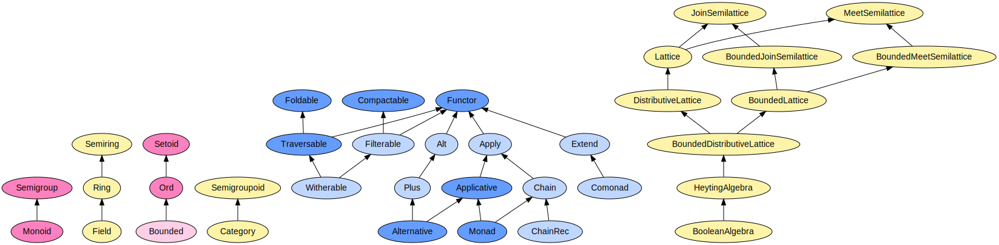

<h3 align="center">
  <a href="docs/index.md">
    
  </a>
</h3>

<p align="center">
Functional programming in TypeScript
</p>

<p align="center">
  <a href="https://travis-ci.org/gcanti/fp-ts">
    
  </a>
  <a href="https://david-dm.org/gcanti/fp-ts">
    
  </a>
  <a href="https://www.npmjs.com/package/fp-ts">
    
  </a>
</p>

Inspired by [PureScript](http://www.purescript.org), [static-land](https://github.com/rpominov/static-land), Scala.

The idea (faking higher kinded types in TypeScript) is based on [Lightweight higher-kinded polymorphism](https://www.cl.cam.ac.uk/~jdy22/papers/lightweight-higher-kinded-polymorphism.pdf)

# Installation

To install the stable version:

```
npm install --save fp-ts
```

# TypeScript compatibility

The stable version is tested against TypeScript 3.0.1, but should run with TypeScript 2.3.0+ too

# Ecosystem

- [io-ts](https://github.com/gcanti/io-ts) - TypeScript compatible runtime type system for IO validation
- [monocle-ts](https://github.com/gcanti/monocle-ts) - Functional optics: a (partial) porting of scala monocle to
  TypeScript
- [newtype-ts](https://github.com/gcanti/newtype-ts) - Implementation of newtypes in TypeScript
- [logging-ts](https://github.com/gcanti/logging-ts) - Composable loggers for TypeScript
- [fp-ts-routing](https://github.com/gcanti/fp-ts-routing) - A type-safe bidirectional routing library for TypeScript
- [parser-ts](https://github.com/gcanti/parser-ts) - String parser combinators for TypeScript
- [remote-data-ts](https://github.com/devex-web-frontend/remote-data-ts) - RemoteData type (check [this article](https://medium.com/@gcanti/slaying-a-ui-antipattern-with-flow-5eed0cfb627b))
- [retry-ts](https://github.com/gcanti/retry-ts) - Retry combinators for monadic actions that may fail
- [fp-ts-local-storage](https://github.com/gcanti/fp-ts-local-storage) - fp-ts bindings for LocalStorage

## Bindings

- [fp-ts-rxjs](https://github.com/gcanti/fp-ts-rxjs) - fp-ts bindings for RxJS
- [fp-ts-fluture](https://github.com/gcanti/fp-ts-fluture) - fp-ts bindings for Fluture

# Documentation

- [API Reference](docs/index.md)

## Internals

- [How `HKT`, `URI2HKT`, `URIS` and `Type` work](HKT.md)

## Examples

- [Free monad](examples/Free.ts)
- [MTL-style](examples/mtl.ts)
- OptionT monad transformer
  - [ArrayOption](examples/ArrayOption.ts)
  - [TaskOption](examples/TaskOption.ts)
- EitherT monad transformer
  - [EitherOption](examples/EitherOption.ts)
- StateT monad transformer
  - [StateIO](examples/StateIO.ts)
  - [StateTaskEither](examples/StateTaskEither.ts)
- [Reader monad](examples/Reader.ts)
- ReaderT monad transformer
  - [ReaderIO](examples/ReaderIO.ts)
- Applicative composition
  - [TaskValidation](examples/TaskValidation.ts)
- [Type safe finite state machines with `IxIO`](examples/ixIO.ts)
- [Moore machines](examples/Moore.ts)
- [Debugging with `Trace`](examples/debugging-with-Trace.ts)
- [fantas-eel-and-specification](fantas-eel-and-specification) - Code for the
  [Fantas, Eel, and Specification](http://www.tomharding.me/2017/03/03/fantas-eel-and-specification/) blog series on
  functional programming by Tom Harding

## Type Classes

<a href="type-classes.svg">
  
</a>

# License

The MIT License (MIT)
