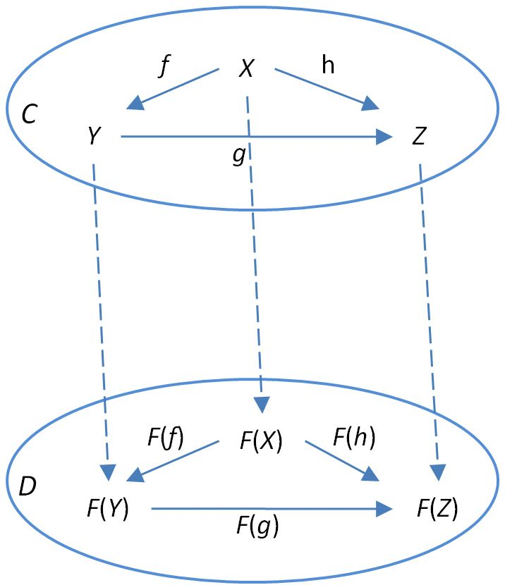

# Getting started with fp-ts: Functor

In the [last post](./Category.md) about categories I presented the _TS_ category (the TypeScript category) and the central problem with function composition

> How can we compose two generic functions `f: (a: A) => B` and `g: (c: C) => D`?

Why finding solutions to this problem is so important?

Because if categories can be used to model programmming languages, morphisms (i.e. functions in _TS_) can be used to model **programs**.

Therefore solving the problem also means to find **how to compose programs in a general way**. And _this_ is pretty interesting for a developer, isn't it?

## Functions as programs

We call **pure program** a function with the following signature

```scala
(a: A) => B
```

Such a signature models a program which accepts an input of type `A` and yields a result of type `B`, without any effect.

We call **effectful program** a function with the following signature

```scala
(a: A) => F<B>
```

Such a signature models a program which accepts an input of type `A` and yields a result of type `B`, along with an **effect** `F`, where `F` is some type constructor.

Recall that a [type constructor](https://en.wikipedia.org/wiki/Type_constructor) is an `n`-ary type operator taking as argument zero or more types, and returning another type.

**Example**

Given the concrete type `string`, the `Array` type constructor returns the concrete type `Array<string>`

Here we are interested in `n`-ary type constructors with `n >= 1`, for example

| Type constructor | Effect (interpretation)         |
| ---------------- | ------------------------------- |
| `Array<A>`       | a non deterministic computation |
| `Option<A>`      | a computation that may fail     |
| `Task<A>`        | an asynchronous computation     |

Now back to our main problem

> How can we compose two generic functions `f: (a: A) => B` and `g: (c: C) => D`?

Since the general problem is intractable, we need to put some _constraint_ on `B` and `C`.

We already know that if `B = C` then the solution is the usual function composition

```ts
function compose<A, B, C>(g: (b: B) => C, f: (a: A) => B): (a: A) => C {
  return a => g(f(a))
}
```

What about the other cases?

## In which the constraint `B = F<C>` leads to functors

Let's consider the following constraint: `B = F<C>` for some type constructor `F`, or in other words (and after some renaming)

- `f: (a: A) => F<B>` is an effectful program
- `g: (b: B) => C` is a pure program

In order to compose `f` with `g` we could find a way to **lift** `g` from a function `(b: B) => C` to a function `(fb: F<B>) => F<C>` so that we can use the usual function composition (the output type of `f` would be the same as the input type of the lifted function)

So we turned the original problem into another one: can we find such a `lift` function?

Let's see some examples

**Example** (`F = Array`)

```ts
function lift<B, C>(g: (b: B) => C): (fb: Array<B>) => Array<C> {
  return fb => fb.map(g)
}
```

**Example** (`F = Option`)

```ts
import { Option, isNone, none, some } from 'fp-ts/lib/Option'

function lift<B, C>(g: (b: B) => C): (fb: Option<B>) => Option<C> {
  return fb => (isNone(fb) ? none : some(g(fb.value)))
}
```

**Example** (`F = Task`)

```ts
import { Task } from 'fp-ts/lib/Task'

function lift<B, C>(g: (b: B) => C): (fb: Task<B>) => Task<C> {
  return fb => () => fb().then(g)
}
```

All those `lift` functions almost look the same. It's not a coincidence, there's a functional pattern under the hood.

Indeed all those type constructors (and many others) admit a **functor instance**.

## Functors

Functors are **mappings between categories** that preserve the categorical structure, i.e. that preserve identity morphisms and composition.

Since categories are constituted of two things (objects and morphisms) a functor is constituted of two things as well:

- a **mapping between objects** that associates to each object `X` in _C_ an object in _D_
- a **mapping between morphisms** that associates to each morphism in _C_ a morphism in _D_

where _C_ and _D_ are two categories (aka two programming languages).


<center>(source: [functor on ncatlab.org](https://ncatlab.org/nlab/show/functor))</center>

Even if a mapping between two different programming languages is an intriguing idea, we are more interested in a mapping where _C_ and _D_ coincide (with _TS_). In this case we talk about **endofunctors** ("endo" means "within", "inside").

From now on when I write "functor" I actually mean an endofunctor in _TS_.

### Definition

A functor is a pair `(F, lift)` where

- `F` is a `n`-ary type constructor (`n >= 1`) which maps each type `X` to the type `F<X>` (**mapping between objects**)
- `lift` is a function with the following signature

```ts
lift: <A, B>(f: (a: A) => B) => ((fa: F<A>) => F<B>)
```

which maps each function `f: (a: A) => B` to a function `lift(f): (fa: F<A>) => F<B>` (**mapping between morphisms**).

The following properties must hold

- `lift(identity`<sub>X</sub>`)` = `identity`<sub>F(X)</sub> (**identities map to identities**)
- `lift(g ∘ f) = lift(g) ∘ lift(f)` (**mapping a composition is the composition of the mappings**)

The `lift` function is also known through a variant called `map`, which is basically `lift` with the arguments rearranged

```ts
lift: <A, B>(f: (a: A) => B) => ((fa: F<A>) => F<B>)
map:  <A, B>(fa: F<A>, f: (a: A) => B) => F<B>
```

Note that `map` can be derived from `lift` (and viceversa).

## Functors in `fp-ts`

How can we define a functor instance in `fp-ts`? Let's see a practical example.

The following declaration defines a model for the response of an API call

```ts
interface Response<A> {
  url: string
  status: number
  headers: Record<string, string>
  body: A
}
```

Note that the `body` field is parametrized, this makes `Response` a good candidate for a functor instance since `Response` is a `n`-ary type constructors with `n >= 1` (a necessary precondition).

In order to define a functor instance for `Response` we must define a `map` function (along with some [technicalities](../recipes/HKT.md) required by `fp-ts`)

```ts
// `Response.ts` module

import { Functor1 } from 'fp-ts/lib/Functor'

export const URI = 'Response'

export type URI = typeof URI

declare module 'fp-ts/lib/HKT' {
  interface URItoKind<A> {
    readonly Response: Response<A>
  }
}

export interface Response<A> {
  url: string
  status: number
  headers: Record<string, string>
  body: A
}

function map<A, B>(fa: Response<A>, f: (a: A) => B): Response<B> {
  return { ...fa, body: f(fa.body) }
}

// functor instance for `Response`
export const functorResponse: Functor1<URI> = {
  URI,
  map
}
```

## Is the general problem solved?

Not at all. Functors allow us to compose an effectful program `f` with a pure program `g`, but `g` must be **unary**, that is it must accept only one argument as input. What if `g` accepts two arguments? Or three?

| Program f | Program g               | Composition   |
| --------- | ----------------------- | ------------- |
| pure      | pure                    | `g ∘ f`       |
| effectful | pure (unary)            | `lift(g) ∘ f` |
| effectful | pure (`n`-ary, `n > 1`) | ?             |

In order to handle such circumstances we need something more: in the next [post](./Applicative.md) I'll talk about another remarkable abstraction of functional programming: **applicative functors**.
