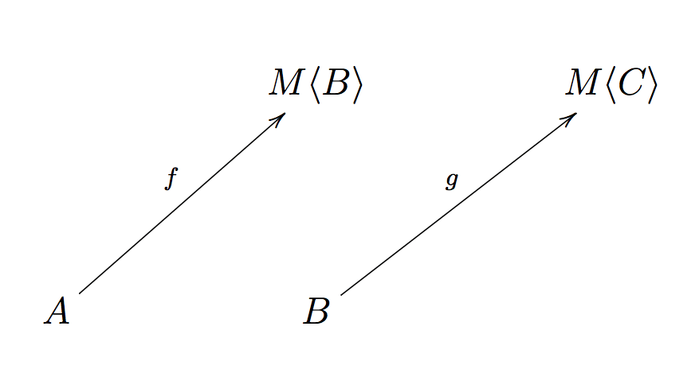
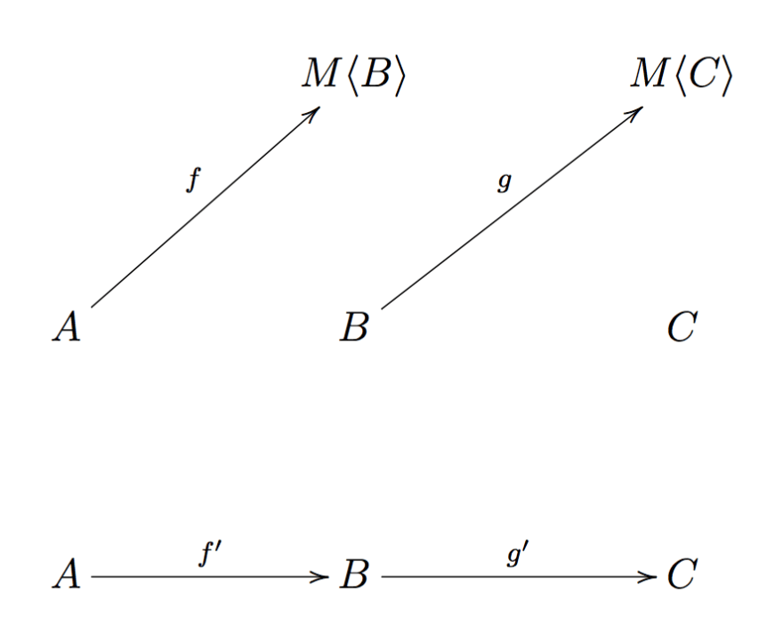
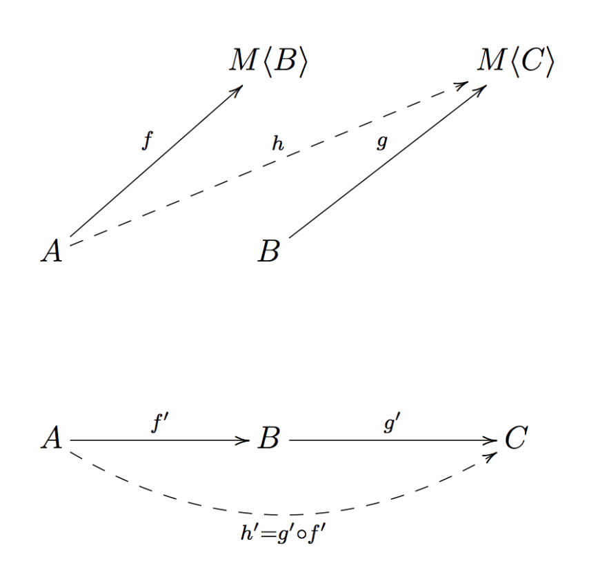
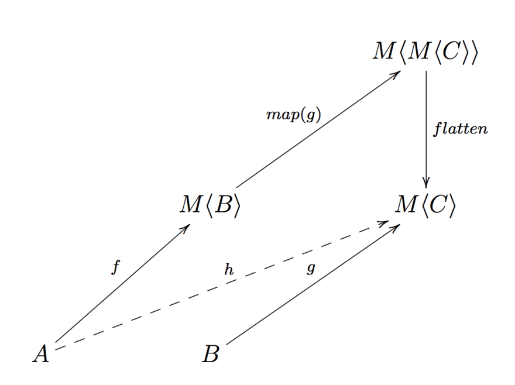
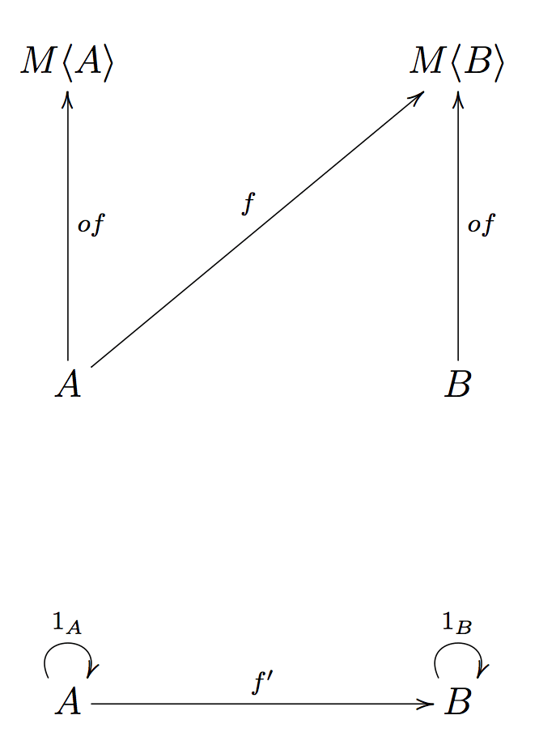

# Getting started with fp-ts: Monad

In the [last](./Applicative.md) post we saw that we can compose an effectful program `f: (a: A) => M<B>` with a pure `n`-ary program `g` by lifting `g`, provided that `M` admits an applicative functor instance

| Program f | Program g     | Composition     |
| --------- | ------------- | --------------- |
| pure      | pure          | `g ∘ f`         |
| effectful | pure, `n`-ary | `liftAn(g) ∘ f` |

<center>where `liftA1 = lift`</center>

However we must solve one last case: what if **both** programs are effectful?

```ts
f: (a: A) => M<B>
g: (b: B) => M<C>
```

What's the "composition" of such `f` and `g`?

In order to handle this last case we need something more powerful than `Functor` since it's quite easy to end up with nested contexts.

## The problem: nested contexts

To better explain why we need something more, let's see some examples.

**Example** (`M = Array`)

Say we want to retrive the followers of the followers of a Twitter user:

```ts
interface User {
  followers: Array<User>
}

const getFollowers = (user: User): Array<User> => user.followers

declare const user: User

const followersOfFollowers: Array<Array<User>> = getFollowers(user).map(getFollowers)
```

There's something wrong here, `followersOfFollowers` has the type `Array<Array<User>>` but we want `Array<User>`.

We need to **flatten** the nested arrays.

The `flatten: <A>(mma: Array<Array<A>>) => Array<A>` function exported by `fp-ts` comes in handy

```ts
import { flatten } from 'fp-ts/lib/Array'

const followersOfFollowers: Array<User> = flatten(getFollowers(user).map(getFollowers))
```

Nice! What about other data structures?

**Example** (`M = Option`)

Say we want to calculate the inverse of the head of a numeric list

```ts
import { Option, some, none, option } from 'fp-ts/lib/Option'
import { head } from 'fp-ts/lib/Array'

const inverse = (n: number): Option<number> => (n === 0 ? none : some(1 / n))

const inverseHead: Option<Option<number>> = option.map(head([1, 2, 3]), inverse)
```

Opss, I did it again, `inverseHead` has the type `Option<Option<number>>` but we want `Option<number>`.

We need to **flatten** the nested `Option`s.

```ts
import { isNone } from 'fp-ts/lib/Option'

const flatten = <A>(mma: Option<Option<A>>): Option<A> => (isNone(mma) ? none : mma.value)

const inverseHead: Option<number> = flatten(option.map(head([1, 2, 3]), inverse))
```

All those `flatten` functions... It's not a coincidence, there's a functional pattern under the hood.

Indeed all those type constructors (and many others) admit a **monad instance** and

> `flatten` is the most peculiar operation of monads

So what's a monad?

This is how monads are often presented...

## Definition

A monad is defined by three things:

(1) a type constructor `M` which admits a [Functor](./Functor.md) instance

(2) a function `of` with the following signature

```ts
of: <A>(a: A) => HKT<M, A>
```

(3) a function `flatMap` with the following signature

```ts
flatMap: <A, B>(f: (a: A) => HKT<M, B>) => ((ma: HKT<M, A>) => HKT<M, B>)
```

**Note**: recall that the `HKT` type is the `fp-ts` way to represent a generic type constructor, so when you see `HKT<M, X>` you can think to the type constructor `M` applied to the type `X` (i.e. `M<X>`).

The functions `of` and `flatMap` are required to obey three laws:

- `flatMap(of) ∘ f = f` (**Left identity**)
- `flatMap(f) ∘ of = f` (**Right identity**)
- `flatMap(h) ∘ (flatMap(g) ∘ f) = flatMap((flatMap(h) ∘ g)) ∘ f` (**Associativity**)

where `f`, `g`, `h` are all effectful functions and `∘` is the usual function composition.

## Ok but... why?

Back in the day when I first saw such a definition my first reaction was bewilderment.

All these questions were spinning around in my head:

- why those two particular operations and why they have those types?
- why the name "flatMap"?
- why the laws? What do they mean?
- but above all, where's my `flatten`?

This post will try to answer each question.

Let's get back to our problem: what's the composition of two effectful functions (also called **Kleisli arrows**)?



<center>(two Kleisli arrows, what's their composition?)</center>

I don't even know what its type is.

Wait... we already encountered an abstraction that is all about composition. Do you remember what I said about [categories](./Category.md)?

> Categories capture the essence of composition

We can turn our problem into a category problem: can we find a category that models the composition of Kleisli arrows?

## The Kleisli category

Let's try to build a category _K_ (named **Kleisli category**) which only contains effectful functions:

- the **objects** are the same objects of the _TS_ category, that is all the TypeScript types.
- the **morphisms** are built like this: whenever there's a Kleisli arrow `f: A ⟼ M<B>` in _TS_ we draw an arrow `f': A ⟼ B` in _K_



<center>(above the _TS_ category, below the _K_ construction)</center>

So what would be the composition of `f'` and `g'` in _K_? That's the dashed arrow labeled `h'` in the image below



<center>(above the composition in the _TS_ category, below the composition in the _K_ construction)</center>

Since `h'` is an arrow that goes from `A` to `C`, there should be a corresponding function `h` from `A` to `M<C>` in `TS`.

So a good candidate for the composition of `f` and `g` in _TS_ is still an effectful function with the following signature: `(a: A) => M<C>`.

How can we build such a function? Well, let's try!

## In which we build the composition step by step

The point (1) of the monad defintion says the `M` admits a functor instance, so we can `lift` the function `g: (b: B) => M<C>` to a function `lift(g): (mb: M<B>) => M<M<C>>` (here I'm using its synonym `map`)



<center>(where `flatMap` comes from)</center>

And now we are stuck: there's no legal operation on the functor instance which is able to **flatten** a value of type `M<M<C>>` to a value of type `M<C>`, we need an additional `flatten` operation.

If we can define such operation then we can obtain the composition we are looking for

<center><code>h = flatten ∘ map(g) ∘ f</code></center>

But wait, `flatten ∘ map(g)` is **flatMap**, that's where the name comes from!

<center><code>h = flatMap(g) ∘ f</code></center>

We can now update our "composition table"

| Program f | Program g     | Composition      |
| --------- | ------------- | ---------------- |
| pure      | pure          | `g ∘ f`          |
| effectful | pure, `n`-ary | `liftAn(g) ∘ f`  |
| effectful | effectful     | `flatMap(g) ∘ f` |

<center>where `liftA1 = lift`</center>

What about `of`? Well, `of` comes from the identity morphisms in _K_: for each identity morphism 1<sub>A</sub> in _K_ there should be a corresponding function from `A` to `M<A>` (i.e. `of: <A>(a: A) => M<A>`).



<center>(where `of` comes from)</center>

## The laws

Last question: where do the laws come from? They are just the category laws in _K_ translated into _TS_:

| Law            | _K_                               | _TS_                                                            |
| -------------- | --------------------------------- | --------------------------------------------------------------- |
| Left identity  | 1<sub>B</sub> ∘ `f'` = `f'`       | `flatMap(of) ∘ f = f`                                           |
| Right identity | `f'` ∘ 1<sub>A</sub> = `f'`       | `flatMap(f) ∘ of = f`                                           |
| Associativity  | `h' ∘ (g' ∘ f') = (h' ∘ g') ∘ f'` | `flatMap(h) ∘ (flatMap(g) ∘ f) = flatMap((flatMap(h) ∘ g)) ∘ f` |

## Monads in `fp-ts`

In `fp-ts` the `flatMap` function is modeled by a variant called `chain`, which is basically `flatMap` with the arguments rearranged

```ts
flatMap: <A, B>(f: (a: A) => HKT<M, B>) => ((ma: HKT<M, A>) => HKT<M, B>)
chain:   <A, B>(ma: HKT<M, A>, f: (a: A) => HKT<M, B>) => HKT<M, B>
```

Note that `chain` can be derived from `flatMap` (and viceversa).

Now if we get back to the examples showing the problem with nested contexts we can fix them by using `chain`

```ts
import { array, head } from 'fp-ts/lib/Array'
import { Option, option } from 'fp-ts/lib/Option'

const followersOfFollowers: Array<User> = array.chain(getFollowers(user), getFollowers)

const headInverse: Option<number> = option.chain(head([1, 2, 3]), inverse)
```

## Conclusion

Functional programming provides universal ways to compose functions with effects: functors, applicative functors and monads are all abstractions that offer principled tools for composing different kind of programs.
