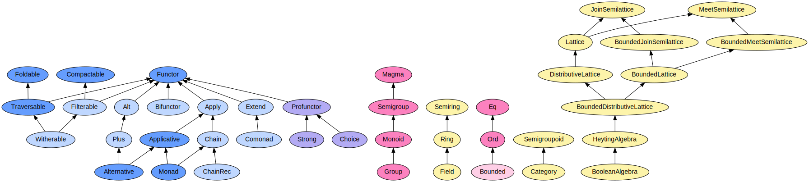

# Reference documentation

This section provides technical reference material for the functions, data types, and type classes provided by fp-ts.
{: .fs-6 .fw-300 }

---

## Functions and utilities

* [function](./function.ts.html)
* [Console](./Console.ts.html)
* [Date](./Date.ts.html)
* [Random](./Random.ts.html)

## Data types

In your code you will make heavy use of data types to model your domain. Data types can be instantiated so you can work with your data using the functionality they provide. Many data types implement functionality from [type classes](#type-classes) to help you write expressive code.

* [Array](./Array.ts.html)
* [Const](./Const.ts.html)
* [Either](./Either.ts.html)
* [EitherT](./EitherT.ts.html)
* [Identity](./Identity.ts.html)
* [IO](./IO.ts.html)
* [IOEither](./IOEither.ts.html)
* [IORef](./IORef.ts.html)
* [Map](./Map.ts.html)
* [NonEmptyArray](./NonEmptyArray.ts.html)
* [Option](./Option.ts.html)
* [OptionT](./OptionT.ts.html)
* [Reader](./Reader.ts.html)
* [ReaderEither](./ReaderEither.ts.html)
* [ReaderT](./ReaderT.ts.html)
* [ReaderTaskEither](./ReaderTaskEither.ts.html)
* [Record](./Record.ts.html)
* [Set](./Set.ts.html)
* [State](./State.ts.html)
* [StateReaderTaskEither](./StateReaderTaskEither.ts.html)
* [StateT](./StateT.ts.html)
* [Store](./Store.ts.html)
* [Task](./Task.ts.html)
* [TaskEither](./TaskEither.ts.html)
* [These](./These.ts.html)
* [Traced](./Traced.ts.html)
* [Tree](./Tree.ts.html)
* [Tuple](./Tuple.ts.html)
* [Writer](./Writer.ts.html)

## Type classes

Type classes describe what you can do with your data. Implementations are provided by [data types](#data-types).

* [Alt](./Alt.ts.html)
* [Alternative](./Alternative.ts.html)
* [Applicative](./Applicative.ts.html)
* [Apply](./Apply.ts.html)
* [Bifunctor](./Bifunctor.ts.html)
* [BooleanAlgebra](./BooleanAlgebra.ts.html)
* [Bounded](./Bounded.ts.html)
* [BoundedDistributiveLattice](./BoundedDistributiveLattice.ts.html)
* [BoundedJoinSemilattice](./BoundedJoinSemilattice.ts.html)
* [BoundedLattice](./BoundedLattice.ts.html)
* [BoundedMeetSemilattice](./BoundedMeetSemilattice.ts.html)
* [Category](./Category.ts.html)
* [Chain](./Chain.ts.html)
* [ChainRec](./ChainRec.ts.html)
* [Choice](./Choice.ts.html)
* [Comonad](./Comonad.ts.html)
* [Compactable](./Compactable.ts.html)
* [Contravariant](./Contravariant.ts.html)
* [DistributiveLattice](./DistributiveLattice.ts.html)
* [Eq](./eq.ts.html)
* [Extend](./Extend.ts.html)
* [Field](./Field.ts.html)
* [Filterable](./Filterable.ts.html)
* [FilterableWithIndex](./FilterableWithIndex.ts.html)
* [Foldable](./Foldable.ts.html)
* [FoldableWithIndex](./FoldableWithIndex.ts.html)
* [Functor](./Functor.ts.html)
* [FunctorWithIndex](./FunctorWithIndex.ts.html)
* [Group](./Group.ts.html)
* [HeytingAlgebra](./HeytingAlgebra.ts.html)
* [Invariant](./Invariant.ts.html)
* [JoinSemilattice](./JoinSemilattice.ts.html)
* [Lattice](./Lattice.ts.html)
* [Magma](./Magma.ts.html)
* [MeetSemilattice](./MeetSemilattice.ts.html)
* [Monad](./Monad.ts.html)
* [MonadIO](./MonadIO.ts.html)
* [MonadTask](./MonadTask.ts.html)
* [MonadThrow](./MonadThrow.ts.html)
* [Monoid](./Monoid.ts.html)
* [Ord](./Ord.ts.html)
* [Ordering](./Ordering.ts.html)
* [Profunctor](./Profunctor.ts.html)
* [Ring](./Ring.ts.html)
* [Semigroup](./Semigroup.ts.html)
* [Semigroupoid](./Semigroupoid.ts.html)
* [Semiring](./Semiring.ts.html)
* [Strong](./Strong.ts.html)
* [Traversable](./Traversable.ts.html)
* [TraversableWithIndex](./TraversableWithIndex.ts.html)
* [Unfoldable](./Unfoldable.ts.html)
* [Witherable](./Witherable.ts.html)

## Infrastructure

These modules enable the core functionality of fp-ts.

* [HKT](./HKT.ts.html)
